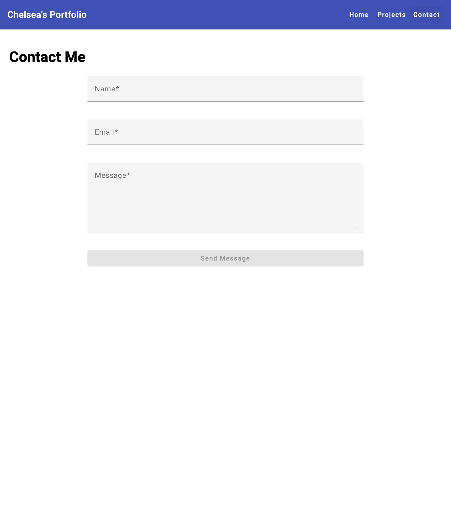

# Portfolio Template

##_Note: This is a test of a portfolio app created with Bolt.ai_

An Angular 17 portfolio application built with standalone components and Angular Material.

## Getting Started

### Prerequisites
- Node.js and npm

### Installation
```bash
npm install
```

### Development
Start the development server:
```bash
npm run dev
```
The application will be available at http://localhost:4200

### Build
Build for production:
```bash
npm run build
```

## Screenshots

### Home Page


### Projects Page


### Project Detail Page


### Contact Page


### Mobile View


## Features

- Responsive design with desktop and mobile navigation
- Angular Material UI components
- Portfolio sections: Home, Projects, Contact
- Individual project detail pages
- Modern Angular 17 standalone component architecture

## Project Structure

- `src/main.ts` - Application bootstrap
- `src/app/app.routes.ts` - Route definitions
- `src/app/` - Feature components (home, projects, contact)
- `src/global_styles.css` - Global styles
